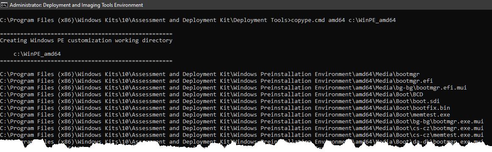
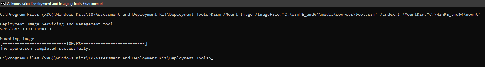
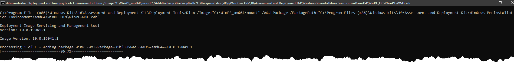
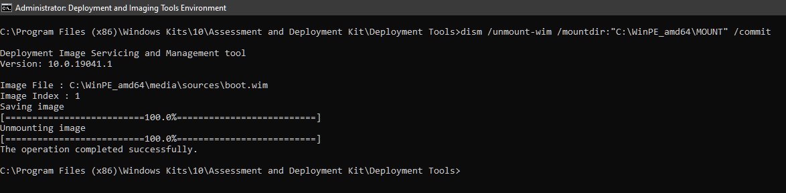
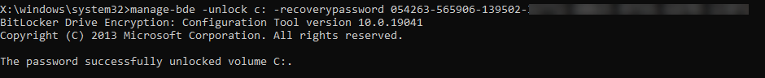

<br>

If you need to access the contents of a Bitlocker-locked drive in Windows Preinstallation Environment, you'll need a Window PE that supports Bitlocker operations.

- [Requirements](#requirements)
- [Creating the WinPE Bootable Image / Media](#creating-the-winpe-bootable-image--media)
- [Unlocking a Bitlocker Drive in WinPE](#unlocking-a-bitlocker-drive-in-winpe)

## Requirements

- Install the [*Windows ADK* and *Windows PE Add-on*](https://docs.microsoft.com/en-us/windows-hardware/get-started/adk-install#other-adk-downloads)* on your computer. This guide will be using Windows ADK for Windows 10 and Add-on version 2004.
- You should know your drive's [Bitlocker recovery key(s)](https://adamtheautomator.com/bitlocker-recovery-key/).

## Creating the WinPE Bootable Image / Media

1. Run **Deployment and Imaging Tools Environment** as administrator.

    

2. Run the command below to copy the working files to the *c:\WinPE_amd64* directory. You can use any directory you want.

    ```powershell
    copype.cmd amd64 c:\WinPE_amd64
    ```

    

3. Mount the WinPE Image.

    ```powershell
    Dism /Mount-Image /ImageFile:"C:\WinPE_amd64\media\sources\boot.wim" /Index:1 /MountDir:"C:\WinPE_amd64\mount"
    ```

    

4. Add the BitLocker-required package to the Win PE image by running the commands below, one at a time.

    ```powershell
    Dism /Image:"C:\WinPE_amd64\mount" /Add-Package /PackagePath:"C:\Program Files (x86)\Windows Kits\10\Assessment and Deployment Kit\Windows Preinstallation Environment\amd64\WinPE_OCs\WinPE-WMI.cab"

    Dism /Image:"C:\WinPE_amd64\mount" /add-package /packagepath:"C:\Program Files (x86)\Windows Kits\10\Assessment and Deployment Kit\Windows Preinstallation Environment\amd64\WinPE_OCs\en-us\WinPE-WMI_en-us.cab"

    Dism /Image:"C:\WinPE_amd64\mount" /Add-Package /PackagePath:"C:\Program Files (x86)\Windows Kits\10\Assessment and Deployment Kit\Windows Preinstallation Environment\amd64\WinPE_OCs\WinPE-NetFx.cab"

    Dism /Image:"C:\WinPE_amd64\mount" /add-package /packagepath:"C:\Program Files (x86)\Windows Kits\10\Assessment and Deployment Kit\Windows Preinstallation Environment\amd64\WinPE_OCs\en-us\WinPE-NetFx_en-us.cab"

    Dism /Image:"C:\WinPE_amd64\mount" /add-package /packagepath:"C:\Program Files (x86)\Windows Kits\10\Assessment and Deployment Kit\Windows Preinstallation Environment\amd64\WinPE_OCs\WinPE-EnhancedStorage.cab"

    Dism /Image:"C:\WinPE_amd64\mount" /add-package /packagepath:"C:\Program Files (x86)\Windows Kits\10\Assessment and Deployment Kit\Windows Preinstallation Environment\amd64\WinPE_OCs\en-us\WinPE-EnhancedStorage_en-us.cab"

    Dism /Image:"C:\WinPE_amd64\mount" /add-package /packagepath:"C:\Program Files (x86)\Windows Kits\10\Assessment and Deployment Kit\Windows Preinstallation Environment\amd64\WinPE_OCs\WinPE-Scripting.cab"

    Dism /Image:"C:\WinPE_amd64\mount" /add-package /packagepath:"C:\Program Files (x86)\Windows Kits\10\Assessment and Deployment Kit\Windows Preinstallation Environment\amd64\WinPE_OCs\en-us\WinPE-Scripting_en-us.cab"

    Dism /Image:"C:\WinPE_amd64\mount" /add-package /packagepath:"C:\Program Files (x86)\Windows Kits\10\Assessment and Deployment Kit\Windows Preinstallation Environment\amd64\WinPE_OCs\WinPE-FMAPI.cab"

    Dism /Image:"C:\WinPE_amd64\mount" /add-package /packagepath:"C:\Program Files (x86)\Windows Kits\10\Assessment and Deployment Kit\Windows Preinstallation Environment\amd64\WinPE_OCs\WinPE-SecureStartup.cab"

    Dism /Image:"C:\WinPE_amd64\mount" /add-package /packagepath:"C:\Program Files (x86)\Windows Kits\10\Assessment and Deployment Kit\Windows Preinstallation Environment\amd64\WinPE_OCs\en-us\WinPE-SecureStartup_en-us.cab"
    ```

    

5. Unmount the WinPE image and commit the changes.

    ```powershell
    dism /unmount-wim /mountdir:"C:\WinPE_amd64\MOUNT" /commit
    ```

6. Create the bootable WinPE image / media.
    - WinPE ISO. This command will create the ISO in *C:\WinPE_amd64\WinPE_amd64.iso*. To use this image, you will need to burn the ISO to a CD or DVD. Another option is to create a bootable USB drive with it using a utility like [Rufus](https://rufus.ie/en_US/).

        ```powershell
        MakeWinPEMedia /ISO C:\WinPE_amd64 C:\WinPE_amd64\WinPE_amd64.iso
        ```

        

    - USB. This command will install WinPE to the USB drive U:

        ```powershell
        MakeWinPEMedia /UFD C:\WinPE_amd64 U:
        ```

## Unlocking a Bitlocker Drive in WinPE

1. Boot to WinPE (CD or DVD). This process differs depending on your computer. You may need to make changes in your BIOS before you can successfully boot to a CD or USB.
2. Assuming that your Bitlocker drive is drive C, run the command below.

    ```powershell
    manage-bde -unlock c: -recoverypassword [recovery key]
    ```

    

Now you can access the contents of the drive.