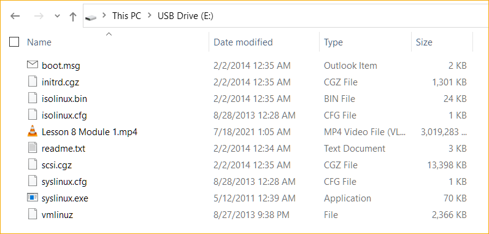
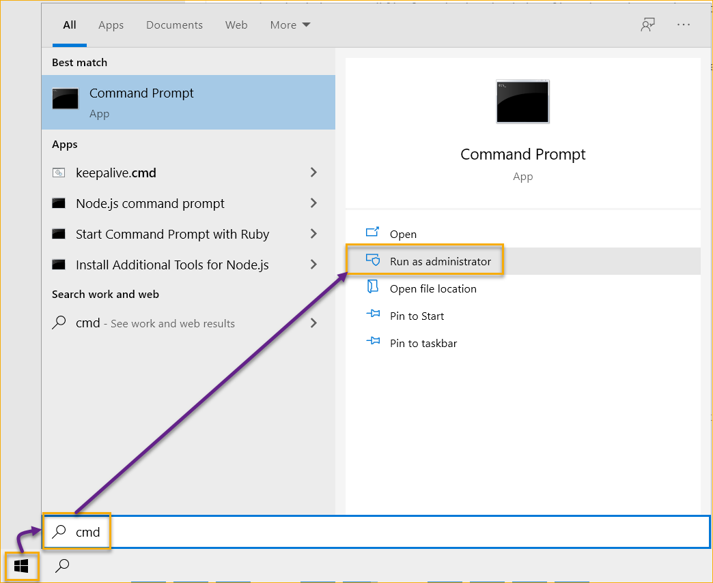
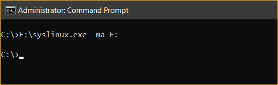

<br>

We're humans and we forget things like passwords. But if you forget your Windows 10 user account password, you can still reset it so you can gain access to your computer again. And for that, you'll need the [NTPasswd](https://pogostick.net/~pnh/ntpasswd/) utility.

NTPasswd is an old tool (last update was on 2014) that admins and users can use to reset local user passwords, promote standard users to administrators, and enable/unlock users including the built-in administrator account.

There are two ways to use NTPasswd; from a CD or USB. In this post, you will learn ways to create a bootable USB drive containing the NTPasswd utility.

- [Requirements](#requirements)
- [Creating the NTPasswd Bootable USB Drive](#creating-the-ntpasswd-bootable-usb-drive)

## Requirements

1. An empty USB flash drive.
2. A Windows computer where you'll create the bootable USB. This tutorial will be using a Windows 10 PC.
3. Download the [NTPasswd USB installer](https://pogostick.net/~pnh/ntpasswd/usb140201.zip). As of this writing, the latest installer file name is *usb140201.zip*.

## Creating the NTPasswd Bootable USB Drive
1. After downloading the NTPasswd USB installer file, extract its contents into the root of the USB flash drive. The image below shows the files on the USB flash drive's root folder after the extraction.

    

2. Next, open an elevated command prompt window. To do so, press `CTRL+R`, type in `cmd` and press Enter.

    

3. Now, execute the `syslinux.exe` command to make the USB drive bootable. To do so, run the command below.

    ```PowerShell
    # The -ma switch means to (m) install the master boot record (MBR) and (a) mark the partition as active.
    # The E: is the drive letter of the USB drive. Yours may be different.

    E:\syslinux.exe -ma E:
    ```

    

    That's it! You now have a bootable NTPasswd USB drive.