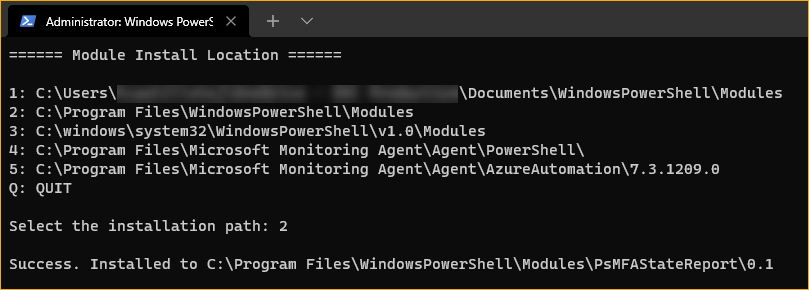
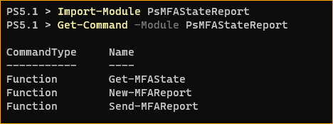
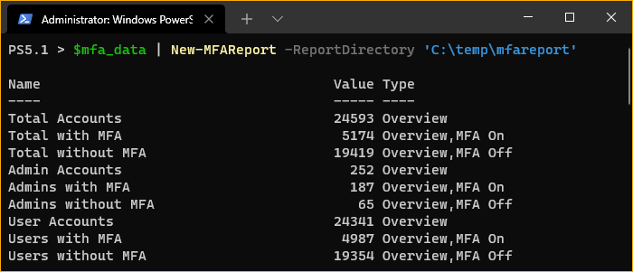
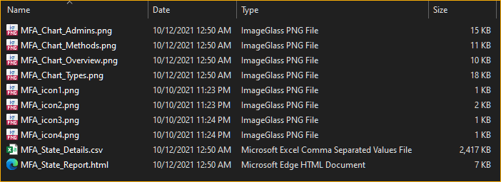
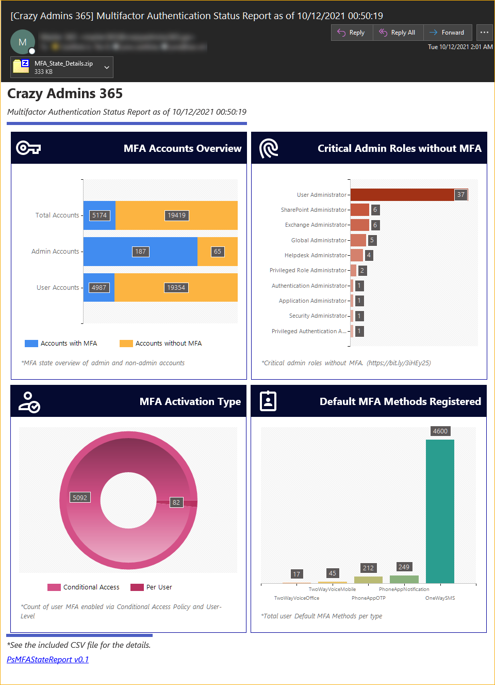
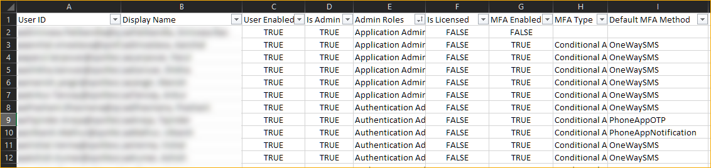

<br>

Nowadays, securing your credentials is an essential part of your online life. Organizations are (slowly but surely) implementing multifactor authentication (MFA) to safeguard their users' identities. And if you are an Azure AD admin, then so should you.

Perhaps you've already enabled MFA. Now what? How do you track if your users have already registered and set up their MFA details? There are reports available in the Azure AD portal, or you can manually run commands in PowerShell (which you should already know, right?).

However, in most cases, admins will want to set up scheduled and unattended reporting. And that's where the PsMFAStateReport module can help.

- [Requirements](#requirements)
- [Installing the PsMFAStateReport Module](#installing-the-psmfastatereport-module)
- [Using the PsMFAStateReport Module](#using-the-psmfastatereport-module)
  - [Step 1: Retrieving User MFA Data](#step-1-retrieving-user-mfa-data)
  - [Step 2: Generate the Report](#step-2-generate-the-report)
  - [Step 3: Send the Report](#step-3-send-the-report)
- [The Final Results](#the-final-results)
  - [Email Report](#email-report)
  - [CSV File Report](#csv-file-report)

## Requirements

- [`MSOnline`](https://www.powershellgallery.com/packages/MSOnline) module. This module retrieves the Azure AD user details using the [`Get-MsolUser`](https://docs.microsoft.com/en-us/powershell/module/msonline/get-msoluser) cmdlet under the hood.
- An admin account with at least the [*User Administrator*](https://docs.microsoft.com/en-us/azure/active-directory/roles/permissions-reference#user-administrator) role assigned. This account is what you'll use to connect to Azure AD and is the required minimum to read MFA-related user properties.

  > **REMINDER!!!** - ***If you plan to run this module unattended, such as with the Task Scheduler, your admin account should not be MFA-enabled.***

- An SMTP or mailbox account for sending the email report. Unless you have an SMTP relay that does not require an account to send external emails. In Microsoft 365, you could use a shared mailbox account as the sender mailbox.

## Installing the PsMFAStateReport Module

> *Note: Since this module depends on the `MSOnline` module, it follows that you can only use this module reliably in Windows PowerShell 5.1 at the latest.*

1. Download the [latest release](https://github.com/junecastillote/PsMFAStateReport/releases/latest).
2. Extract the zip file and run the `.\InstallMe.ps1` script in PowerShell.
3. When asked where to install the module, press the corresponding number to your choice. The example below installs the module to *`2: C:\Program Files\Windowspowershell\Modules`*. Doing so assumes that you are installing the module from an elevated PowerShell session (as admin).
    

    After the installation, there will be three new commands available to use.

    
    - `Get-MFAState` - Retrieves the MFA user state details from Azure AD.
    - `New-MFAReport` - Generates the report summary email and graphs to your specified destination folder.
    - `Send-MFAReport` - Send the report via email.

## Using the PsMFAStateReport Module

> *Note: The subsequent steps assume that you already have PowerShell open and connected to Azure AD using the [`Connect-MsolService`](https://docs.microsoft.com/en-us/powershell/module/msonline/connect-msolservice) command*

### Step 1: Retrieving User MFA Data

> Note: By default, all PsMFAStateReport commands will not display any information on the screen during run time except for warnings and errors. To display all available information, either set the `$InformationPreference` to `Continue` or append the `-InformationAction Continue` parameter to every command.

There are four options to retrieve user MFA data using the `Get-MFAState` command.
1. All users.
2. Admins only.
3. A collection of user objects (returned by the `Get-MsolUser` cmdlet).
4. One or more specified UserPrincipalNames.

Which option you choose depends on which set of users you want to generate a report for.

To retrieve the MFA data of all users:

```powershell
$mfa_data = Get-MFAState -AllUsers
```


To retrieve the MFA data of all admins only:

```powershell
$mfa_data = Get-MFAState -AdminOnly
```

To retrieve the MFA data of a collection of users:

```powershell
# Retrieve the MFA data of the first 10 Azure AD users
$mfa_data = Get-MFAState -UserObject (Get-MsolUser -MaxResults 10)
```

To retrieve the MFA data of one or more users by their UserPrincipalName values:

```powershell
$upn = @('user1@domain.com','user2@domain.com')
$mfa_data = Get-MFAState -UserPrincipalName $upn
```

At this point, the MFA data can already be export to CSV if that's all you need. Otherwise, proceed to the next step.

### Step 2: Generate the Report

After retrieving the MFA data in the previous step, you'll use that data to generate the report using the `New-MFAReport` command.

The `New-MFAReport` command only has two parameters:

- `-InputObject` accepts the MFA data you retrieved from the previous step.
- `-ReportDirectory` specifies the directory to save the report files (HTML, CSV, and PNG files). If the directory does not exist, the command will attempt to create it.

To generate the report:

```powershell
New-MFAReport -InputObject $mfa_data -ReportDirectory 'C:\temp\mfareport'
```

Alternately, you can also pass the MFA data through the pipeline because the `-InputObject` parameter accepts values from the pipeline values like so:

```powershell
$mfa_data | New-MFAReport -ReportDirectory 'C:\temp\mfareport'
```



After generating the report, confirm that you now have the report files in the report directory. As you can see below, the CSV file, HTML, and  PNG resource files were created.



You can now use these reports as they are if you want to stop here. But if you want to send these reports in an email, proceed to the last step.

### Step 3: Send the Report

Finally, after generating the MFA status report, sending the report via email to intended recipients only requires you to run the `Send-MFAReport` command.

At a minimum, if you're using an anonymous SMTP relay on port 25, the below code snippet should be enough to send the report.

```powershell
Send-MFAReport `
-ReportDirectory 'c:\temp\mfareport' `
-SmtpServer 'smtp.server.here' `
-From 'Sender name <sender@domain.com>' `
-To @('recipient1@domain.com', 'recipient2@domain.com')
```
The parameters used in the above code are:
- `-ReportDirectory` specifies the directory where it will get the report files.
- `-SmtpServer` specifies the SMTP relay server IP address or name.
- `-From` specifies the sender's email address.
- `-To` specifies the list of recipients.

Other `Send-MFAReport` parameters:
- `-Port` specifies the SMTP port number to use. If not specified, the default is 25.
- `-UseSSL` is a switch parameter to specify if the SMTP relay requires SSL/TLS connection. For example, Exchange Online (smtp.office365.com) relay requires this.
- `-Credential` specifies the [`PSCredential`](https://adamtheautomator.com/powershell-get-credential/) object used to authenticate to the SMTP server if required.
- `-Cc` used to add Cc recipients.
- `-Bcc` used to add Bcc recipients.
- `-AttachCsv` determines if the CSV file will be attached to the email report. The default value is `-$true`. If you don't want to attach the CSV file, set this parameter value to `$false`.
- `-ZipCsvSizeinMB` the size threshold (of the CSV file in MB) before the command compresses the CSV file before attaching it to the email report. If not specified, the default value is `2`, which means that if the CSV file size is 2MB or bigger, it will be compressed into a zip file before sending the email.

If sending through an authenticated SMTP relay such as Exchange Online, use the code below as example:

```powershell
# Create the SMTP credential object programmatically
$userName = 'username here'
$userPassword = 'password here' | ConvertTo-SecureString -AsPlainText -Force
$smtpCredential = [System.Management.Automation.PSCredential]::new($userName, $userPassword)

# OR, if manually, you can run: $smtpCredential | Get-Credential

# Compose the email properties splat.
$mail_splat = @{
    SmtpServer      = 'smtp.office365.com' # SMTP server address.
    Port            = 587 # SMTP server port number.
    UseSSL          = $true # SMTP server required SSL/TLS.
    Credential      = $smtpCredential # SMTP server credential object.
    From            = 'Sender display name <sender@domain.com>' # sender address.
    To              = 'to1@domain.com', 'to2@domain.com', 'to3@domain.com' # to recipients.
    CC              = 'cc1@domain.com','cc2@domain.com' ## cc recipients.
    Bcc             = 'bcc1@domain.com','bcc2@domain.com' ## bcc recipients.
    ReportDirectory = 'c:\temp\mfareport' # directory containing the report files.
    ZipCsvSizeinMB  = 3 # Zip the CSV file is the filesize is 3MB or bigger.
}
# Send the report
Send-MFAReport @mail_splat
```

## The Final Results

### Email Report

The image below is similar to what your recipient should recieve in their email. As you can see, there are four visual cards that shows the summary of different MFA-related statistics.

> Admittedly, I am not a UI/UX designer :)



### CSV File Report

The CSV report, as shown below, contains the MFA details from where the HTML and email report derived from.

