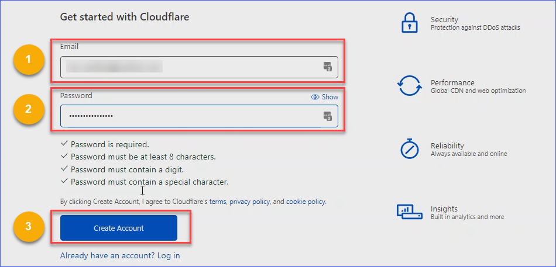
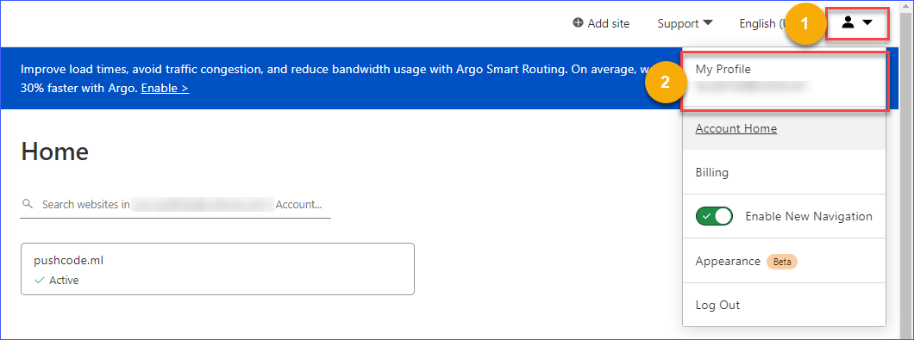
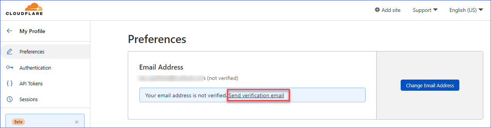
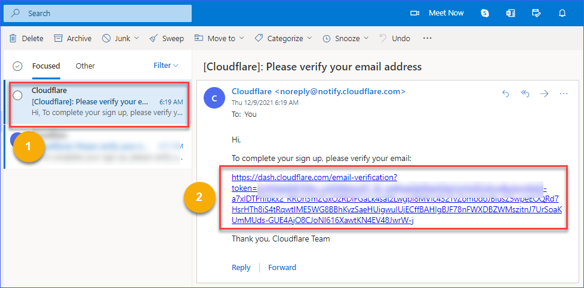
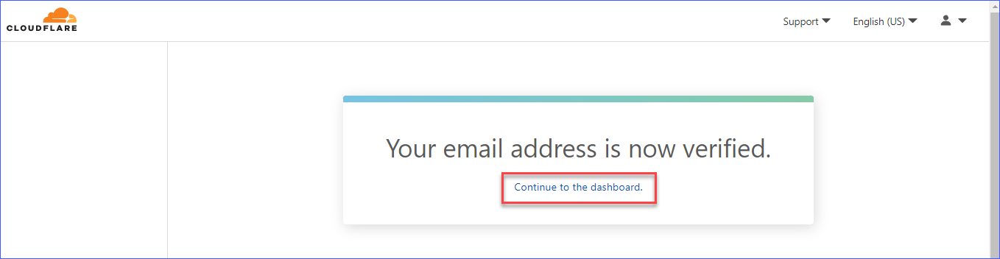

 

In the previous article, you learned **[How to Get a Free Domain From Freenom](https://lazyexchangeadmin.cyou/freenom-free-domain/)**. Now that you have a domain, you could continue managing your DNS records using the Freenom DNS tools if you wish.

But there is a limited type of DNS records you can add in Freenom. Lucky for you, you are not stuck with Freenom to manage your DNS records. Cloudflare offers free and more advanced features.

In this post, you’ll learn how to transition your DNS management away from Freenom to Cloudflare.

## Table of Contents <!-- omit in toc -->
- [Creating a Free Cloudflare Account](#creating-a-free-cloudflare-account)
- [Adding Your Domain to Cloudflare](#adding-your-domain-to-cloudflare)
- [Changing to Cloudflare Nameservers](#changing-to-cloudflare-nameservers)
- [Conclusion](#conclusion)

## Creating a Free Cloudflare Account

Like many other products and services, Cloudflare offers a free basic account. Yes, [Cloudflare](http://cloudflare.com) lets you create a free account with basic support. A pretty good deal for beginners, would you agree? Follow these steps to register and activate your free Cloudflare account.

1. Navigate to the [Cloudflare sign-up page](https://dash.cloudflare.com/sign-up).
2. On the **Get started with Cloudflare** page, enter your email address and nominate a password for your new Cloudflare account. Ensure that you comply with the password complexity requirements stated on the page.

    

    Sign up for a new Cloudflare account

3. Click on the Profile icon on the upper-right-hand side and click **My Profile** to verify your email address.

    

    Open your Cloudflare profile page

4. Under Preferences and Email Address, click **Send verification email**.

    

    Send verification email

5. Log in to your email account, click the verification email from Cloudflare, and click the link to complete your sign-up.

    

    Verifying your email address

6. Once you’ve successfully verified your email address, you will see the following prompt below. Click **Continue to the dashboard**.

    

    Continue to Dashboard

## Adding Your Domain to Cloudflare

Now that you have access to a brand new Cloudflare account, the next step is to add your domain.

1. On your Dashboard, click **Add a Site**.

    

    Click Add a site on the dashboard

2. Type in your domain and click **Add site**.

    

    Enter your domain name

3. Scroll down and select **Free** from the available plans, then click **Continue**.

    

    Select the free plan

    Cloudflare will scan for existing DNS records of your domain after selecting the free plan and may take a few seconds to complete.

    

    Quick scan

4. Create a new dummy DNS record so that you can proceed. Click **Add record** and enter the values exactly as shown below. Click **Save** when you're done.

    

5. Make sure to copy both name servers below. You will need these in the succeeding steps.

    

    Copy the Cloudflare name servers

## Changing to Cloudflare Nameservers

1. Open a new tab and log in to [freenom.com](http://freenom.com). On the upper right-hand side, click **Services** and then click **My Domains.**

    

2. On the **My Domains** page click **Manage Domain** of the site you are setting up with Cloudflare.

    

    Click Manage Domain

3. Click the **Management Tools** dropdown and select **Nameservers**.

    

    Open Nameservers page

4. Select **Use custom nameservers** and paste the nameservers you copied from Cloudflare on the Nameservers page. Lastly, click **Change Nameservers**.

    

    Select Use custom nameservers

5. Toggle back to the Cloudflare tab and click **Done, check nameservers.**

    

    Check nameservers

6. Click **Finish later** on the **Quick Start Guide** page that follows.

    

    Click Finish later

7. Wait for the confirmation email. When Cloudflare confirms that you’ve successfully updated your domain’s nameservers, you will receive an email similar to the example below.

    

    Site activation confirmation email

Congratulations! You can now start managing your DNS records in Cloudflare for a domain hosted in Freenom.

## Conclusion

Cloudflare does not only allow you to manage your DNS records, but it also offers the following benefits: making your website load faster, securing your website and the Internet users that visit it.

Watch out for you our follow-up article on how to host your site with GitHub Pages. Thank you for reading!